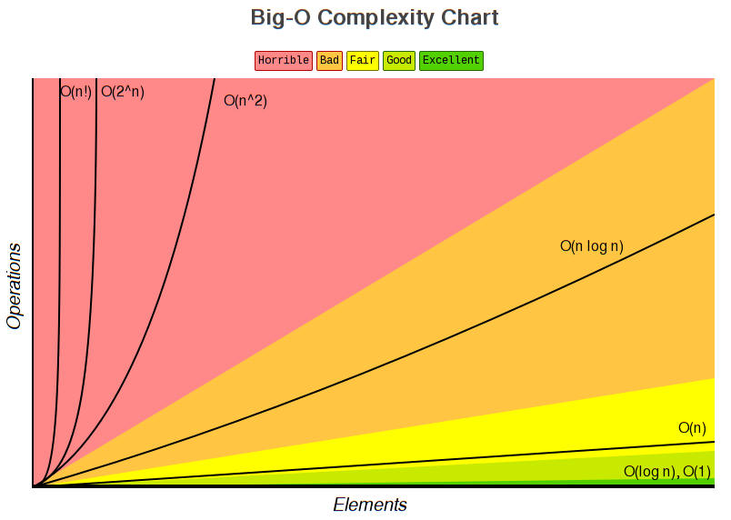

Big O expresses an algorithm's runtime in terms of how quickly the runtime or [[202012021203 Space Complexity in Big O|space complexity]] grows as the input to an algorithm gets bigger and bigger up to an indefinite, arbitrary point. The input of an algorithm is called [[202012021155 n]].

Those expressions look like this:

| Rating | Expression | Name | What It Means |
| --- | --- | --- | --- |
| Excellent | `O(1)` | constant time | runtime stays the same relative to the size of the input |
| Excellent | `O(lg n)` |  |  |
| Fair | `O(n)` | linear time | runtime increases linearly relative to input size |
| Horrible | `O(n²)` | quadratic time |  |
| Horrible | `O(2ⁿ)` |  |  |
| Horrible | `O(n!)` | exponential time | complexity grows exponentially relative to input. |

And, compared, look like this:

 [#rowell-KnowThyComplexities]

An algorithm can be described by several expressions, depending on [[202012021213 Case]].

`n` often needs to be [[202012021139 Simplifying n|simplified]].

---

[#rowell-KnowThyComplexities]: Rowell, E. (n.d.). Know Thy Complexities. Retrieved 9 December 2020, from Big-O Algorithm Complexity Cheat Sheet (Know Thy Complexities!) @ericdrowell website: https://www.bigocheatsheet.com/

---

#bigO
